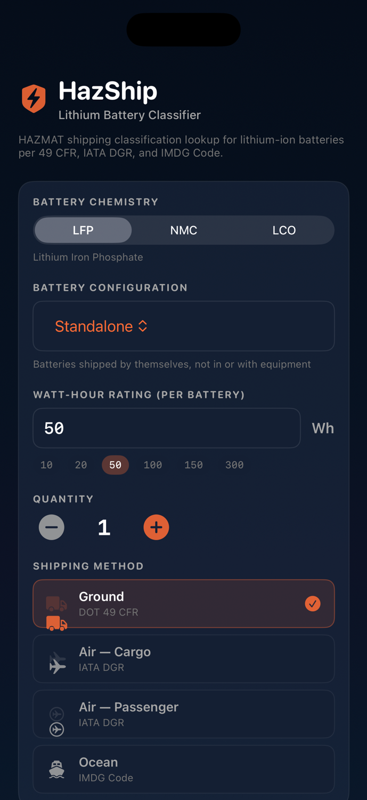

# HazShip ⚡

**Lithium Battery HAZMAT Shipping Classification Lookup**

A native iOS app that instantly classifies lithium-ion battery shipments against the full regulatory matrix — 49 CFR, IATA DGR, and IMDG Code. Input your battery specs, get the exact UN number, packing instruction, required labels, documentation checklist, and carrier restrictions.

Built to demonstrate deep fluency in HAZMAT logistics regulations for lithium battery transport at scale.

<p align="center">
  
</p>

---

## Why This Exists

Shipping lithium batteries is one of the most regulation-heavy operations in logistics. A single classification error — wrong UN number, wrong packing instruction, missing label — can result in shipment rejection, fines, or worse.

HazShip encodes the entire regulatory decision tree into a fast, offline lookup tool:

- **49 CFR §173.185** (U.S. ground/rail transport)
- **IATA DGR 66th Edition** (international air transport)
- **IMDG Code Amendment 42-24** (ocean freight)

No backend. No API calls. Pure on-device regulatory logic.

---

## What It Does

| Input | Output |
|-------|--------|
| Battery chemistry (LFP, NMC, LCO) | **UN Number** (UN3480, UN3481, UN3536) |
| Watt-hour rating per battery | **Packing Instruction** (PI 965, 966, 967) |
| Battery configuration | **Packing Section** (IA, IB, II) |
| Quantity | **Packaging requirements** per mode |
| Shipping method (Ground/Air/Ocean) | **Labels & marks** checklist |
| | **Documentation checklist** (interactive) |
| | **Carrier restrictions** (USPS, UPS, FedEx, DHL) |
| | **Prohibition detection** (e.g., PI 965 on PAX aircraft) |

### Classification Decision Tree

```
Configuration → UN Number
  Standalone                → UN3480
  Packed with Equipment     → UN3481
  Contained in Equipment    → UN3481
  Installed in CTU          → UN3536

Configuration → Packing Instruction
  Standalone                → PI 965
  Packed with Equipment     → PI 966
  Contained in Equipment    → PI 967
  Installed in CTU          → Special Provisions (SP 389/390)

Watt-Hours → Packing Section
  ≤20 Wh per battery        → Section II  (reduced requirements)
  20–100 Wh per battery     → Section IB  (full regulation)
  >100 Wh per battery       → Section IA  (full regulation, enhanced)
```

### Prohibitions Detected

| Scenario | Result |
|----------|--------|
| Standalone (PI 965) on passenger aircraft | ❌ **PROHIBITED** |
| Section I batteries on passenger aircraft | ❌ **PROHIBITED** |
| USPS standalone batteries via air | ❌ **PROHIBITED** |

---

## Tech Stack

| Component | Technology |
|-----------|-----------|
| **UI** | SwiftUI (iOS 17+) |
| **Architecture** | Engine pattern — pure functions, no state |
| **Design** | Dark mode, SF Symbols, custom design system |
| **Data** | Fully offline, embedded regulatory data |
| **Dependencies** | Zero. No third-party packages. |

---

## Project Structure

```
HazShip/
├── Models/
│   ├── BatteryInput.swift          # Input enums + model
│   └── ClassificationResult.swift  # Output types
├── Engine/
│   ├── ClassificationEngine.swift  # Core decision tree
│   ├── PackagingEngine.swift       # Packaging requirements
│   ├── LabelingEngine.swift        # Labels & marks
│   ├── DocumentationEngine.swift   # Documentation checklist
│   └── RestrictionsEngine.swift    # Carrier restrictions
├── Views/
│   ├── Theme.swift                 # Design system
│   ├── InputFormView.swift         # User input form
│   ├── ResultsView.swift           # Results container
│   └── Components/
│       ├── ClassificationHeroCard.swift
│       ├── PackagingSection.swift
│       ├── LabelingSection.swift
│       ├── DocumentChecklistSection.swift
│       ├── RestrictionsSection.swift
│       └── ChemistryNotesSection.swift
├── HazShipApp.swift                # App entry point
└── Assets.xcassets/
```

---

## Regulatory Sources

The classification logic is derived from:

- [49 CFR §173.185](https://www.ecfr.gov/current/title-49/subtitle-B/chapter-I/subchapter-C/part-173/subpart-E/section-173.185) — Lithium cells and batteries
- [IATA Dangerous Goods Regulations (DGR)](https://www.iata.org/en/publications/dgr/) — 66th Edition (2025)
- [IMDG Code Amendment 42-24](https://www.imo.org/en/OurWork/Safety/Pages/DangerousGoods-default.aspx) — Maritime dangerous goods
- [PHMSA Lithium Battery Guide](https://www.phmsa.dot.gov/lithium-batteries-training-resources) — Updated Nov 2024

> **Disclaimer**: This is a reference tool. It is not a substitute for consulting the actual regulations or obtaining compliance certification. Always verify classification with your carrier and regulatory authority.

---

## Getting Started

### Requirements

- Xcode 15.4+ (tested with Xcode 17)
- iOS 17.0+ deployment target
- No CocoaPods, SPM, or external dependencies

### Build & Run

```bash
git clone https://github.com/mrbese/HazShip.git
cd HazShip
open HazShip.xcodeproj
```

Select a simulator and press `⌘R`.

---

## Chemistry Profiles

| Chemistry | Thermal Stability | Energy Density | Risk Level |
|-----------|-------------------|----------------|------------|
| **LFP** (Lithium Iron Phosphate) | Excellent (~270°C) | Lower | 🟢 Low |
| **NMC** (Nickel Manganese Cobalt) | Moderate (~210°C) | High | 🟡 Moderate |
| **LCO** (Lithium Cobalt Oxide) | Lowest (~150°C) | Very High | 🔴 High |

---

## License

Licensed under the PolyForm Noncommercial License 1.0.0 — free for noncommercial use; commercial use requires the author's permission. See [LICENSE](LICENSE) for details.
